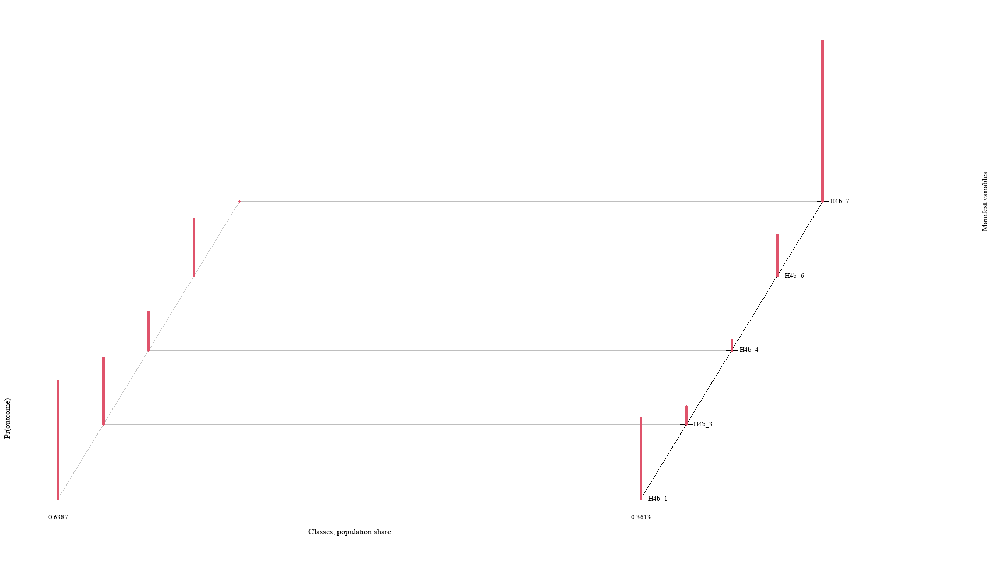

# (PART) 中级统计 {-}

# (PART) 高级统计 {-}

# (PART) 结构方程模型 {-}

# 潜变量分析 {#LatentVariablesAnalysis}

## 潜分类分析 (Latent Class Analysis) {#LatentClassAnalysis .panelset}

### R {-}

<br>

使用`poLCA`做潜在分类分析。首先导入该包：

```{r eval=FALSE}
library(poLCA)
```

`poLCA()`函数可用于潜类别分析。`poLCA()`需要设置以下2个参数：

- `formula`：公式，形式为`response ~ predictors`。
- `data`：使用的数据，需要为`data.frame`。

如果要改变分类数，则设置`nclass`参数，默认值为2。

以下以`research_dta`为要分析的数据集，`H4b_1`, `H4b_3`, `H4b_4`, `H4b_6`, `H4b_7`为外显变量，示例如下：

```{r eval=FALSE}
f1 <- cbind(H4b_1, H4b_3, H4b_4, H4b_6, H4b_7) ~ 1
LCA2 <- poLCA(f1, data = research_dta, nclass = 2)
```

返回的结果`LCA2`为`list`对象，其中`LCA2$probs`为各变量在各分类上的概率；`LCA2$predclass`为预测分类。可以使用`plot(LCA2)`以获取可视化结果：

```{r echo=FALSE}

```


### Stata {-}

<br>

有待补充。

## 潜在剖面分析 (Latent Profile Analysis) {#LatentProfileAnalysis}

## 潜在特质分析 (Latent Trait Analysis) {#LatentTraitAnalysis}

## 因子分析 (Factor Analysis) {#FactorAnalysis}
